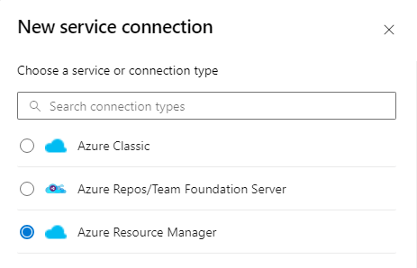
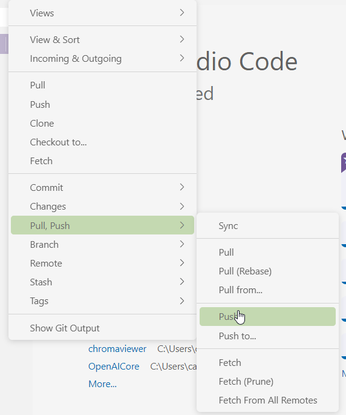
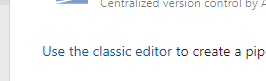
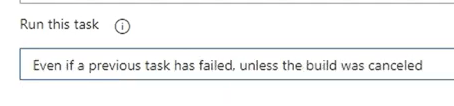
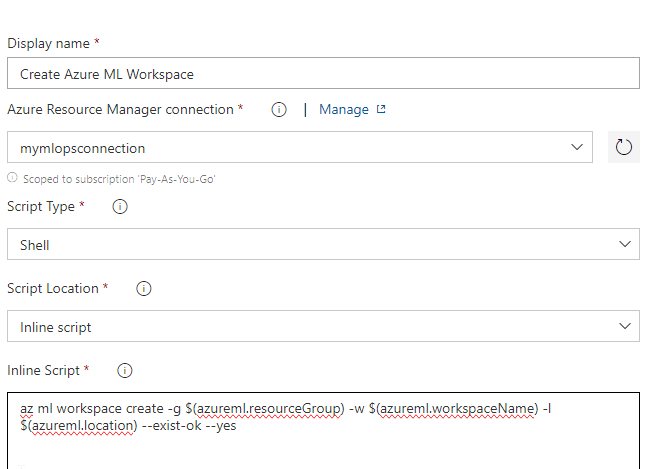
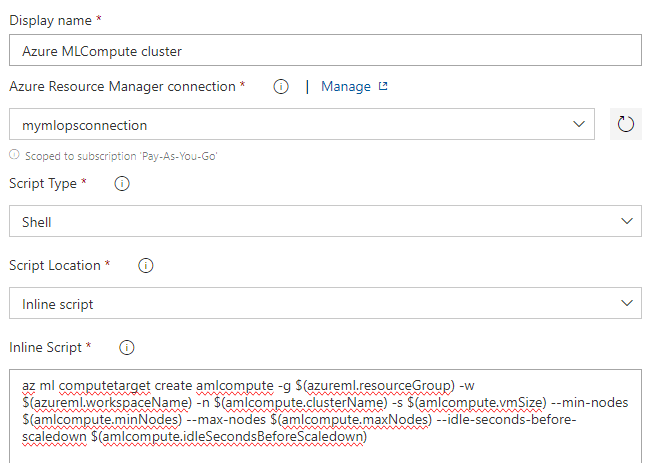
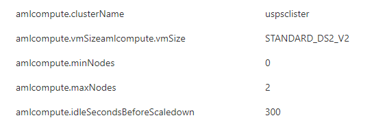
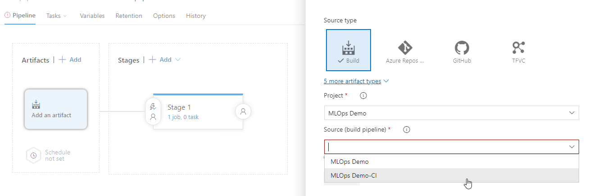

### High level steps
Download code from my repo
https://github.com/cloudtrainerwork/MLOps_Workshop

### Connect to subscription
Authenticate to Azure Subscription
- Project Settings
- Service Connections



- Grant access permissions to all pipelines

### Create Infrastructure as Code
- Create a pipeline
- Create a variable group: **mlops-wsh-vg**
```
RESOURCE_GROUP:uspsrg
LOCATION:centralus
BASE_NAME: USPSDemov1
WORKSPACE_NAME:usps-workspace1
WORKSPACE_SVC_CONNECTION:
AZURE_RM_SVC_CONNECTION:
```
### Clone with VS Code
- Genearate credentials
- Click button on repo page to clone in VS Code
- Sign into Azure
- Copy files into repo
- Click on Source Control icon
- Type in message
- Commit
- Push code
    
### Create pipeline
- Start pipeline development
- Click **Azure Repos Git**
- Select repo
- Select **Existing**
    
- Select **iac-create-environment-pipeline-arm.yml**
- Click Continue
- Click Run
- Click Job 
- Give permission (if required)
- 

### Open new Machine learning studio
- Show empty notebook section (no files)
- Create a small compute
- Wait a few minutes to deploy
- Visit Notebook again
- Create terminal
```
git clone [azure devops repo]
```
### Data
- Navigate to the Data tab
- Click on Data stores (umbrella to hold datasets)
- look for the (default) instance
- Datasets tab - click on **Create**
- Create dataset name **insurance_dataset**
- Leave Tabular dataset
- Upload from local
- Accept default blob store
- Upload insurance.csv from data folder
- Start compute - wait for it to spin up
- Return to Data tab
- Generate profile with pre-configured compute
- Listed under Jobs
- Browse the Profile-> results under the Explore tab Under Data

### Continuous Integration
- Create new classic pipeline editor
    
- Continue
- Empty Job
- Set Agent to Ubuntu Latest
- Click on **Trigger** tab
- **Enable continuous integration**
- Return to Tasks
- Add Task - **Use Python 3.x** (update to 3.6)
- Add **Bash** - > Set **Script path** -> Advanced -> Set **Working directory** as **package_requirements**
- Add another **Bash** for data testing
- Change option to inline
```
pytest training/train_test.py --doctest-modules --junitxml=junit/test-results.xml --cov=data_test --cov-report=xml --cov-report=html
```
- Add **publish test results**
- Replace **Test results files**
```
**/test-*.xml
```
- Expand **Control Options** and see **Run this task** is enabled. Always will publish results
- Update dropdown
    
### Add more functionality to CI
- Visit the Azure portal and open the Azure Cloud Shell to install the Azure Machine learning extension
```
az extension add -n azure-cli-ml
```
- Return the the CI Pipeline and put in edit mode
- Add **Azure CLI** Task

    
    
- Add another **Azure CLI** Task
```
az ml workspace create -g $(azureml.resourceGroup) -w $(azureml.workspaceName) -l $(azureml.location) --exist-ok --yes
```



- Add variables that match the script
- Click on Variables in the tabs
- Click Save from the dropdown
- Add another **Azure CLI** Task
```
az ml computetarget create amlcompute -g $(azureml.resourceGroup) -w $(azureml.workspaceName) -n $(amlcompute.clusterName) -s $(amlcompute.vmSize) --min-nodes $(amlcompute.minNodes) --max-nodes $(amlcompute.maxNodes) --idle-seconds-before-scaledown $(amlcompute.idleSecondsBeforeScaledown)
```



- Add in all the variables

    
- Add another **Azure CLI** Task
```
az ml datastore upload -w $(azureml.workspaceName) -g $(azureml.resourceGroup) -n $(az ml datastore show-default -w $(azureml.workspaceName) -g $(azureml.resourceGroup) --query name -o tsv) -p data -u insurance --overwrite true
```
- Run the CI and validate
- Make sure a new Workspace is created, New storage, new compute cluster, etc

### Add more functionality
- add another **Bash** task

```
mkdir metadata && mkdir models
```
- Add another **Azure CLI** Task and set **Working directory** to **training** folder
```
az ml run submit-script -g $(azureml.resourceGroup) -w $(azureml.workspaceName) -e $(experiment.name) --ct $(amlcompute.clusterName) -d conda_dependencies.yml -c train_insurance -t ../metadata/run.json train_aml.py
```
- Add another **Azure CLI** Task 
```
az ml model register -g $(azureml.resourceGroup) -w $(azureml.workspaceName) -n $(model_name) -f metadata/run.json --asset-path
outputs/models/insurance_model.pkl -d "Classification model for filing a claim prediction" --tag "data"="insurance" --tag "model"="classification" --
model-framework ScikitLearn -t metadata/model.json
```

- Add another **Azure CLI** Task 
```
az ml model download -g $(azureml.resourceGroup) -w $(azureml.workspaceName) -i $(id) -r modelId metadata/model.json -t /models --overwrite
```

- Add a **Copy files** task
    - Source folder
    ```
    $(Build.SourcesDirectory)
    ```
    - Contents
    ```
    **/metadata/*
    **/models/*
    **/deployment/*
    **/tests/integration/*
    **/package_requirements/*
    ```
    - Target Folder
    ```
    $(Build.ArtifactStagingDirectory)
    ```
- Add a **Publish Pipeline Artifacts** task
    - File or directory path
    ```
    $(Build.ArtifactStagingDirectory)
    ```
    - Artifact name
    ```
    landing
    ```


### Continuous Deployment
- Create a Release pipeline
- Create **empty job** at Stage 1
- Click on the Artifact and select the CI pipeline



- Click Add
- Click on Stage 1 Tasks
```
az extension add -n azure-cli-ml
```
- Add another Azure CLI
```
az ml model deploy -g $(azureml.resourceGroup) -w $(azureml.workspaceName) -n $(service.name.staging) -f ../metadata/model.json --dc aciDeploymentConfigStaging.yml --ic inferenceConfig.yml --overwrite

```
- 


## Deploy Parts unlimited demo
- https://azuredevopsdemogenerator.azurewebsites.net/